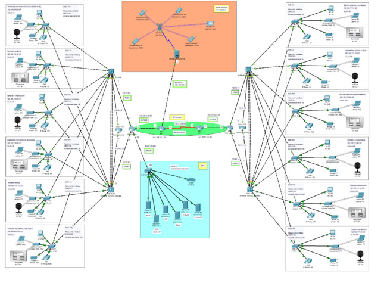

# Cisco Packet Tracer Automation 🖥️🔧

A Python script that automates Cisco Packet Tracer network topology creation using GUI automation. Place devices such as routers, switches, and PCs on a grid and connect them programmatically — no manual clicking required.

<div align="center">
  
</div>

<br>
<div align="center">
  <a href="https://codeload.github.com/TendoPain18/cisco-packet-tracer-auto-topology/legacy.zip/main">
    
  </a>
</div>

## 📋 Description

This project automates the process of building network topologies in Cisco Packet Tracer by controlling the application window through mouse and keyboard simulation. It maps the Packet Tracer canvas to a coordinate grid, allowing devices to be placed and connected by specifying row and column positions instead of pixel coordinates.

## ✨ Features

- **Grid-Based Placement**: A 14×37 coordinate grid maps to the Packet Tracer canvas for easy device positioning
- **Device Support**: Place routers, switches, and PCs via simple function calls
- **Automatic Connection**: Connect any two devices by their grid positions
- **Window Management**: Automatically resizes and focuses the Packet Tracer window
- **Zoom Control**: Programmatic zoom in, zoom out, and default zoom reset

## 🔬 How It Works

The script detects the open Cisco Packet Tracer window, resizes it to a fixed 1920×1080 resolution, and maps its canvas area to a grid. Each grid cell is 50×50 pixels starting from a fixed offset. Functions then simulate mouse clicks on the toolbar and canvas to place devices and draw connections.

**Grid Layout:**
```
Rows: 14  (y: 198 to 848, step 50)
Cols: 37  (x: 61 to 1881, step 50)
```

**Workflow:**
```
1. Detect & resize Packet Tracer window
2. Apply zoom-out to fit canvas
3. Create grid of canvas coordinates
4. Call placement/connection functions with (row, col) arguments
```

## 🚀 Getting Started

### Prerequisites

```
Python 3.7+
Cisco Packet Tracer (installed and open)
```

### Installation

1. **Clone the repository**
```bash
git clone https://github.com/TendoPain18/cisco-packet-tracer-auto-topology.git
cd cisco-packet-tracer-auto-topology
```

2. **Install dependencies**
```bash
pip install pygetwindow pyautogui
```

3. **Open Cisco Packet Tracer**, then run the script
```bash
python main.py
```

## 📖 Usage

Edit the bottom of `main.py` to define your topology:

```python
if is_window_open("Cisco Packet Tracer"):
    win, win_data, grid, used = start()

    add_pc(win, grid, used, 5, 5)           # Place PC at row 5, col 5
    add_pt_switch(win, grid, used, 10, 10)  # Place Switch at row 10, col 10
    add_pt_router(win, grid, used, 2, 18)   # Place Router at row 2, col 18
    connect(win, grid, used, [5, 5], [10, 10])   # Connect PC to Switch
    connect(win, grid, used, [10, 10], [2, 18])  # Connect Switch to Router
```

### Available Functions

| Function | Description |
|----------|-------------|
| `add_pc(win, grid, used, row, col)` | Place a PC at the given grid position |
| `add_pt_switch(win, grid, used, row, col)` | Place a PT Switch |
| `add_pt_router(win, grid, used, row, col)` | Place a PT Router |
| `connect(win, grid, used, [r1,c1], [r2,c2])` | Connect two devices by their grid positions |

> **Note**: The script uses fixed pixel offsets calibrated for a 1920×1080 Packet Tracer window. If the Packet Tracer UI layout differs across versions, toolbar click coordinates may need adjustment.

## 🛠️ Built With

- **Language**: Python
- **Libraries**: `pygetwindow`, `pyautogui`
- **Tool**: Cisco Packet Tracer

## 🙏 Acknowledgments

- Cisco Packet Tracer for the network simulation environment

<br>
<div align="center">
  <a href="https://codeload.github.com/TendoPain18/cisco-packet-tracer-auto-topology/legacy.zip/main">
    
  </a>
</div>

## <!-- CONTACT -->
<!-- END CONTACT -->
